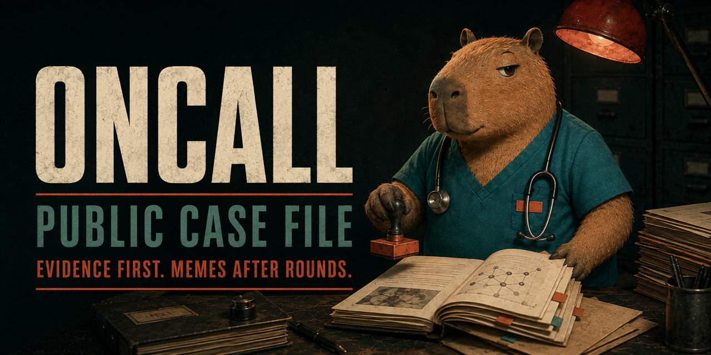
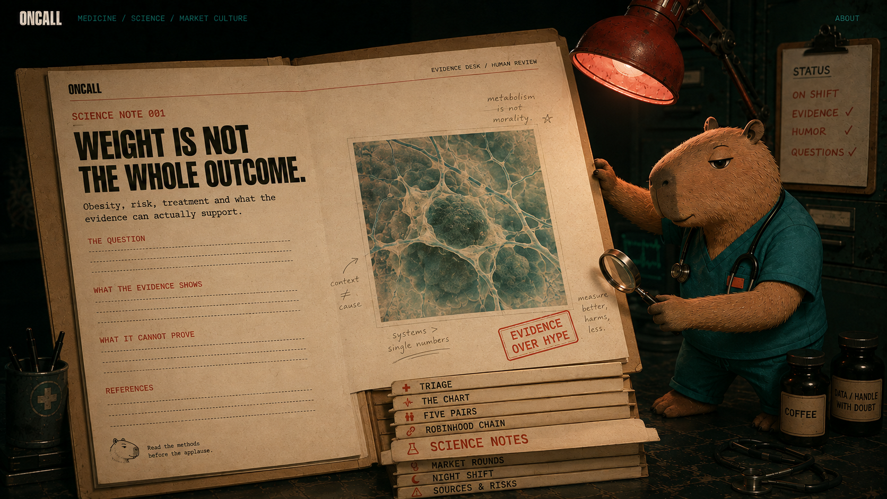
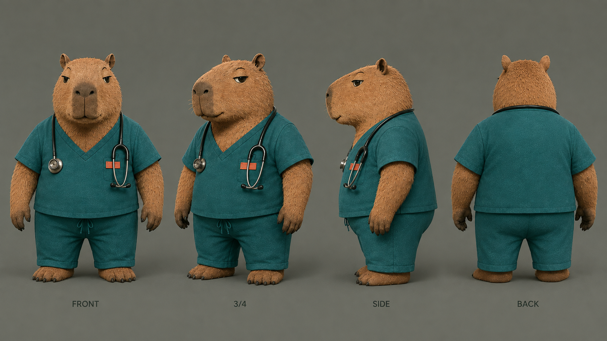
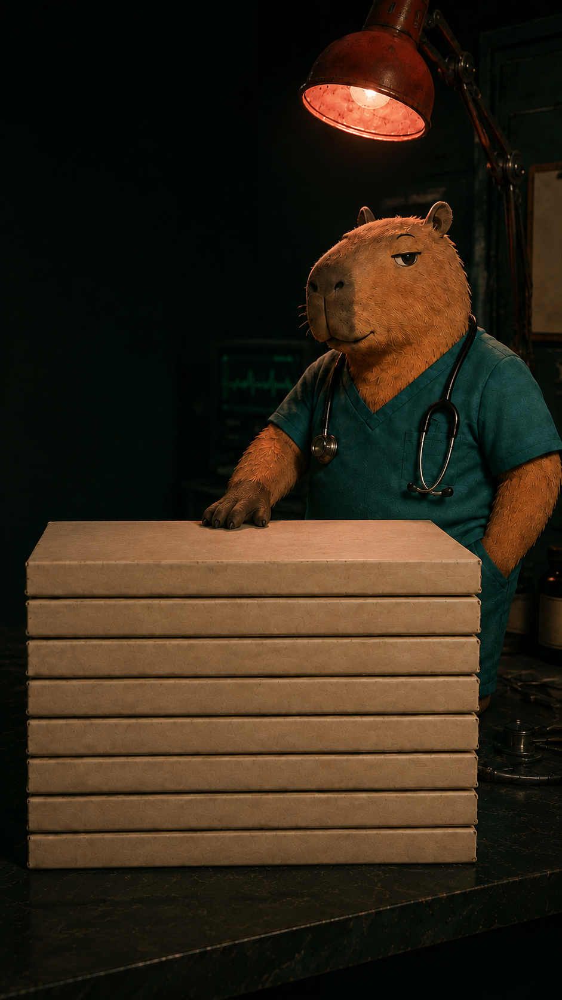

# ONCALL

> **NIGHT SHIFT FOR THE TERMINALLY ONLINE.**<br>
> Medicine gets a source. Markets get context. The capybara gets the late shift.

[](https://github.com/oncallcapy/oncall)

ONCALL is an original mascot-led medicine, science and market-culture meme project designed around a possible PAR multi-market structure on Robinhood Chain. Its public interface is a dark clinical records room: selecting a physical folder pulls it from the stack and opens a full editorial file.

The craft is playful; the claim boundaries are serious. ONCALL is not a medical product, investment product, index fund, collateralized asset or guaranteed tracker. It does not diagnose, recommend treatment or provide investment advice. No affiliation or endorsement by PAR, Robinhood, the five referenced companies, journals or study authors is claimed.

**Public repository:** [github.com/oncallcapy/oncall](https://github.com/oncallcapy/oncall)

## The records room

| File | What is inside | Reading rule |
| --- | --- | --- |
| **Triage** | Opening scene and project voice | Start here; the capybara has the clipboard. |
| **The Chart** | Purpose, verified public fields and non-claims | Unknown launch settings are omitted. |
| **Five Pairs** | LLY, JNJ, HIMS, MRNA and UNH with exact observed quote contracts | Pair identity is market and editorial metadata. |
| **Robinhood Chain** | Network and PAR multi-market mechanics | Architecture does not establish safety or liquidity. |
| **Science Notes** | Five long-form dossiers and 15 traced study records | Read the finding with its limit. |
| **Market Rounds** | Health-company and market narratives | Market context is separate from clinical evidence. |
| **Night Shift** | Original capybara dispatches for social use | A joke cannot supply evidence. |
| **Sources & Risks** | Dated infrastructure sources, API receipt and risk register | A source supports only the claim in its scope. |

## Science, opened



The Science collection contains five dossiers, each mapped editorially to one selected quote identity and containing exactly three study records:

- **LLY / metabolic medicine:** diabetes prevention, intensive lifestyle intervention and cardiovascular outcomes in obesity.
- **JNJ / clinical evidence:** placebo-controlled procedures, fluid strategy evidence and the effect of blinding on estimates.
- **HIMS / digital health:** digitally supported blood-pressure care, telephone consultation and teach-back communication.
- **MRNA / molecular medicine:** vaccine efficacy and safety, germinal-centre biology and population safety surveillance.
- **UNH / health systems:** Medicaid access, bias in population-health algorithms and regional diagnostic practice.

Company and ticker names remain in the editorial mapping. Scientific headings, questions, findings and conclusions remain brand-neutral. Every study file carries its design, question, finding, limits, direct source, persistent identifier and access date. Relevant publisher corrections stay attached to the affected evidence record.

Read the durable research layer:

- [Five-dossier, 15-study source collection](src/content/science)
- [Science Notes editorial contract](science-notes/README.md)
- [Evidence review methodology](methodology/README.md)
- [Source and correction ledger](SOURCE_LEDGER.md)
- [Correction and contribution path](CONTRIBUTING.md)

The dossiers are inspectable source-led review material. Repository inclusion and a successful build do not establish clinical review. Scientific publication requires named human review of the exact revision; no reviewer or review date is invented here.

The release records make that boundary auditable:

- [Science review packet and unresolved human gate](docs/release/2026-09-06-science-review.md)
- [Accepted visual direction, asset hashes and 3D boundary](docs/release/2026-09-06-visual-acceptance.md)

## Five selected quote records

Robinhood’s official assets API reported these five Stock Token deployments as `ASSET_STATUS_ACTIVE` on chain ID `4663` at **2026-09-06T15:38:34Z**. This is a dated metadata observation. It does not establish current PAR priceability, route depth, executable liquidity or an ONCALL pool.

| Symbol | Underlying company | Observed Robinhood Chain contract |
| --- | --- | --- |
| `LLY` | Eli Lilly and Company | `0x8005d266423c7ea827372c9c864491e5786600ea` |
| `JNJ` | Johnson & Johnson | `0x03DfbBE0AC4E7bCDaFd08eD41A400326B77D8c80` |
| `HIMS` | Hims & Hers Health | `0xCceE82fE024c36fA15E1005edE3E9e4787e23D09` |
| `MRNA` | Moderna | `0x43B07D15cE533bEc5476d70C22a78a1B2B662155` |
| `UNH` | UnitedHealth Group | `0xcF364ea52787e289De6F32077834056E3E70D6A8` |

The complete observation receipt, research-track mapping and failure rule are in the [pair records](pair-files/README.md). Stock Tokens are described by Robinhood as tokenized debt securities issued by Robinhood Assets (Jersey) Limited. They provide economic exposure without granting legal or beneficial rights in the underlying issuer; availability and jurisdiction restrictions apply. [Official Stock Token explanation](https://robinhood.com/rhj/stocktokens/).

## Character and visual system



The mascot is an original half-lidded capybara clinician in petrol-teal scrubs, dark stethoscope and coral badge. The palette combines deep clinical green, near-black night tones, ivory paper, natural fur brown and a restrained coral signal. The cinematic prototype uses approved rendered plates and accessible HTML controls; the turntable preserves the character model for the later production rig.

Desktop and mobile use separately composed opening plates:

<table>
  <tr>
    <td></td>
    <td></td>
  </tr>
</table>

Approved concept assets and their role are documented in [assets/github](assets/github/README.md). Motion respects reduced-motion preferences; the physical folder labels remain ordinary links and the content remains usable without client-side animation.

The recorded visual acceptance covers the clinical-file metaphor, opening and opened-Science compositions, capybara turntable, responsive text-free plates and spine-parallel live labels. The current motion is a rendered-plate prototype; the turntable is not a rigged 3D model.

## Local development

Use Node.js 22.12 or later:

```sh
npm ci
npm run dev
```

Open the local address printed by Astro. Validate the complete records room with:

```sh
npm test
npx playwright install chromium
npm run test:e2e
npm run build
```

`npm run preview` serves the static build locally. Local build and preview do not publish the website.

## Evidence and launch limits

- PAR says a multi-market launch can create one to five Uniswap v4 pools, divide supply equally and use one opening market capitalization across them. Read the current [PAR documentation](https://par.family/docs) before any decision.
- PAR describes its contracts as **unaudited**. Documentation, tests and transaction success cannot prove the absence of defects or loss risk.
- The recorded API response is a timestamped observation, not continuous monitoring. Technical quote eligibility, priceability, route depth and liquidity require fresh measurement close to any launch decision.
- Five quote assets do not create share ownership, issuer sponsorship, pooled collateral, index-fund status, diversification or guaranteed tracking.
- Token address, pool addresses, launch receipt, fees, tax, liquidity and route details are absent because no verified public evidence for those fields is recorded.
- AI may assist with code, visual exploration, literature discovery and drafts. It is not an evidence source, author or clinical reviewer. Humans remain responsible for every published scientific and financial claim.

The mascot can stay awake. The source still has to resolve.
